# International Logistics & Trade – Semester Project Report

## Import Compliance Model: Modular Anti-Theft Travel Backpack (China → France)

---

**Course:** International Logistics & Trade (ILT)  
**Author:** Alexandre FERRARI  
**Date:** February 2026  
**Product:** Modular Anti-Theft Travel Backpack (Benchmark: Pacsafe Vibe 25)  
**Route:** Shenzhen, China → Le Havre, France  

---

## Table of Contents

1. [Executive Summary](#1-executive-summary)
2. [Trade Theory Application (ILT1–ILT2)](#2-trade-theory-application-ilt1--ilt2)
3. [Transportation Analysis (ILT3)](#3-transportation-analysis-ilt3)
4. [Tariff Classification Analysis (ILT4)](#4-tariff-classification-analysis-ilt4)
5. [Binding Ruling & Legal Certainty (ILT6)](#5-binding-ruling--legal-certainty-ilt6)
6. [Packing & CBM Analysis (ILT07)](#6-packing--cbm-analysis-ilt07)
7. [Customs Valuation Framework (ILT07)](#7-customs-valuation-framework-ilt07)
8. [Duties & VAT Mechanism (ILT07)](#8-duties--vat-mechanism-ilt07)
9. [Sustainability Integration (ILT5)](#9-sustainability-integration-ilt5)
10. [Integrated Compliance Conclusion](#10-integrated-compliance-conclusion)
11. [Appendices](#appendices)

---

## 1. Executive Summary

This report presents a structured international logistics and compliance model for the importation of a **Modular Anti-Theft Travel Backpack** — benchmarked against the Pacsafe Vibe 25 — manufactured in Shenzhen, China and imported into Le Havre, France. The analysis spans the full scope of the International Logistics & Trade course (ILT1 through ILT07), integrating trade theory, transport economics, tariff classification, legal compliance, customs valuation, and sustainability considerations into a single, coherent decision framework.

### Product Specifications

| Parameter | Value |
|---|---|
| Product | Modular Anti-Theft Travel Backpack |
| Dimensions | 48 × 32 × 18 cm |
| Net Weight | 0.9 kg |
| Gross Weight | 1.1 kg |
| Materials | 70% Polyester/Nylon, 15% EVA foam, 10% Plastic, 5% Metal |
| Key Features | RFID-blocking pocket, lockable zippers, cut-resistant straps, USB charging port |

### Core Findings

| Parameter | Value |
|---|---|
| HS Classification | 4202.92 |
| Origin | Shenzhen, China |
| Destination | Le Havre, France |
| FOB Unit Cost | €18.00 |
| Ocean Freight (per unit) | €2.50 |
| Insurance (per unit) | €0.30 |
| CIF Customs Value (per unit) | €20.80 |
| Applicable Duty Rate | 17.6% |
| Duty per Unit | €3.66 |
| VAT (20%) per Unit | €4.89 |
| **Total Landed Tax per Unit** | **€8.55** |
| Transport Mode Selected | Ocean (FCL) |

The analysis demonstrates that China's comparative advantage in textile-based manufacturing, combined with the cost efficiency of ocean freight and the legal certainty provided by binding tariff rulings, produces a compliant, economically rational, and environmentally defensible import model.

---

## 2. Trade Theory Application (ILT1 – ILT2)

### 2.1 Theoretical Foundation

As introduced in **ILT1 and ILT2**, the principle of **comparative advantage** holds that a country benefits from specialising in the production of goods for which it has the lowest opportunity cost, even if it does not hold an absolute advantage in all sectors. This foundational concept, rooted in Ricardian trade theory, provides the analytical basis for the sourcing decision in this project.

### 2.2 Application: Why China?

The decision to manufacture the Modular Anti-Theft Travel Backpack in China is not arbitrary. It is grounded in a structured evaluation of opportunity cost and specialisation:

| Factor | China | France |
|---|---|---|
| Labour cost (manufacturing) | Low | High |
| Textile production infrastructure | Mature, scaled | Limited, high-cost |
| Component supply chain proximity | Integrated (zippers, fabrics, EVA, RFID) | Fragmented, import-dependent |
| Opportunity cost of backpack production | **Low** | **High** |
| FOB unit cost | €18.00 | Estimated €45–60+ |

China's textile and accessories manufacturing sector represents decades of specialisation. The ecosystem surrounding Shenzhen and Guangdong province integrates raw material suppliers (polyester/nylon fabrics, EVA foam, plastic components, metal hardware), component manufacturers, and assembly facilities within a concentrated geographic area. This **cluster effect** drives down the opportunity cost of producing each unit relative to France, where labour, regulatory overhead, and fragmented supply chains would divert resources away from higher-value economic activities.

### 2.3 Analytical Reasoning

From the perspective of **global production efficiency** — a concept emphasised in ILT2 — the allocation of backpack manufacturing to China and the allocation of higher-value design, branding, and distribution activities to France represents a rational division of labour. France's opportunity cost of manufacturing a textile backpack is high because the same resources (labour, capital, factory space) could be deployed in sectors where France holds a comparative advantage, such as luxury goods, aerospace, or pharmaceuticals.

Conversely, China's opportunity cost is low: its abundant skilled textile labour and established infrastructure mean that backpack production displaces very little alternative high-value output.

**This is not merely a cost argument. It is a specialisation argument.** The sourcing decision reflects the course's teaching that trade gains arise not from absolute cost differences alone, but from the relative structure of opportunity costs across trading partners.

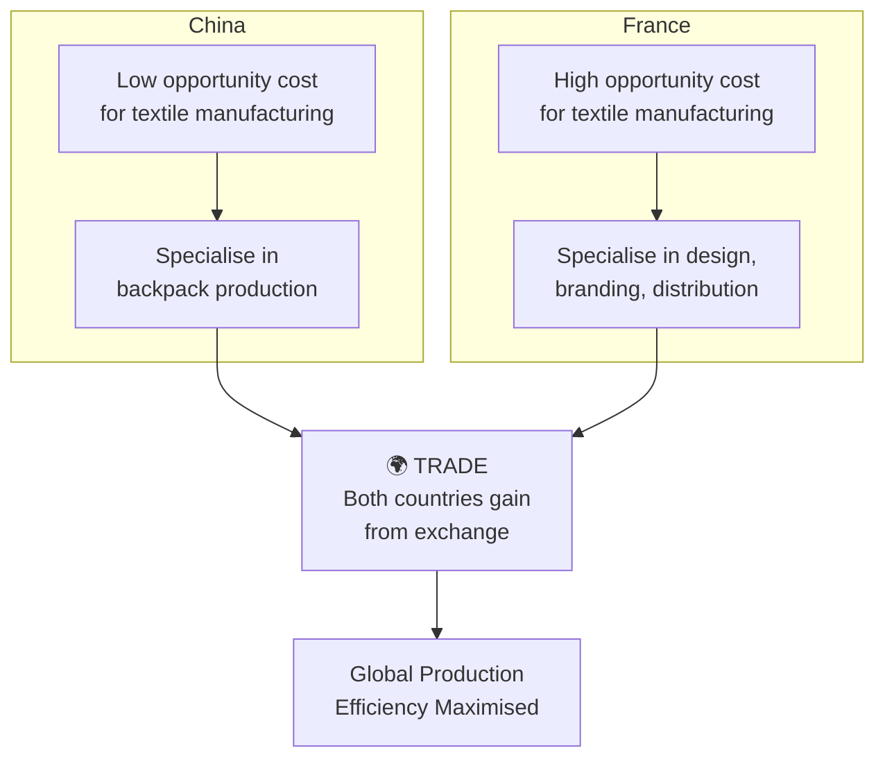

---

## 3. Transportation Analysis (ILT3)

### 3.1 Framework

As covered in **ILT3**, transport mode selection is not a single-variable decision. It requires evaluation across multiple criteria: **cost, speed, reliability, risk, and cargo characteristics**. The course framework positions these as interdependent factors that must be weighed against the specific nature of the goods being shipped.

### 3.2 Mode Comparison

The two viable modes for Shenzhen → Le Havre are ocean freight and air freight. The following table provides a structured comparison:

| Criterion | Ocean Freight | Air Freight |
|---|---|---|
| **Cost per unit** | €2.50 | €7.70 (1.1 kg × €7/kg) |
| **Transit time** | 30–40 days | 5–7 days |
| **Reliability** | High (scheduled liner services) | High (but weather-sensitive) |
| **Risk (damage/loss)** | Low (containerised, non-fragile) | Low |
| **Cargo suitability** | Excellent (non-perishable, no temp. control) | Viable but unnecessary |
| **Cost premium of air** | — | **+208% per unit** |

> *Note: Air freight cost calculated on gross weight (1.1 kg) as per industry standard — volumetric weight is typically lower for compressed flat-packed backpacks.*

### 3.3 Quantitative Demonstration — Cost Per Unit

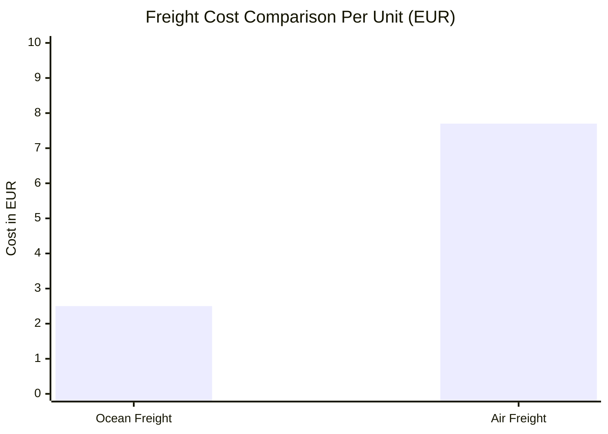

For a shipment of 600 units (100 master cartons):

| | Ocean | Air |
|---|---|---|
| Total freight cost | €1,500 | €4,620 |
| Difference | — | **+€3,120** |

### 3.4 Analytical Justification

The Modular Anti-Theft Travel Backpack is a **non-perishable, non-fragile, non-time-sensitive** consumer good. It does not degrade during transit, does not require temperature control, and is not subject to fashion cycles so short that 30 additional days of transit would erode market value. Under the ILT3 framework, such cargo characteristics strongly favour ocean transport.

The 208% cost premium of air freight is economically unjustifiable given the product profile. The only scenario where air freight would be rational is an emergency replenishment situation — which falls outside the scope of a planned import model.

Furthermore, ocean containerisation provides additional benefits: standardised handling, reduced per-unit risk exposure, and compatibility with full container load (FCL) economics that further reduce cost at scale. The product's packaging — **compressed and flattened in polybag + single-wall carton** — is specifically designed to maximise container space efficiency.

**Conclusion:** Ocean freight (FCL, Shenzhen → Le Havre) is the selected mode, justified on cost, cargo compatibility, and the absence of any time-sensitivity that would warrant the air premium.

---

## 4. Tariff Classification Analysis (ILT4)

### 4.1 The Harmonized System

As introduced in **ILT4**, the Harmonized System (HS) is the internationally standardised nomenclature for the classification of traded goods. Administered by the World Customs Organization (WCO), it provides the foundation for customs duty assessment, trade statistics, and regulatory compliance.

### 4.2 Classification Hierarchy

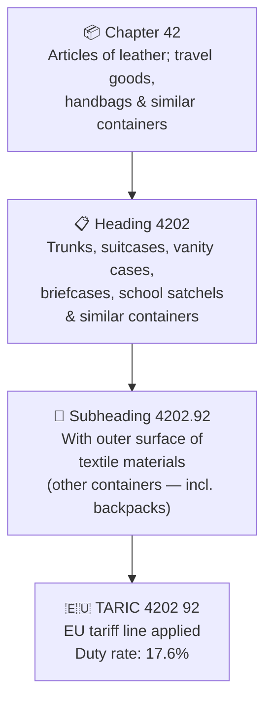

### 4.3 Classification Reasoning

The classification of the Modular Anti-Theft Travel Backpack under **HS 4202.92** is derived through the application of **General Rule of Interpretation 1 (GRI 1)**, which states that classification shall be determined by the terms of the headings and any relative section or chapter notes.

The analytical path is as follows:

**Step 1 — Chapter Identification.**  
The product is a container designed for carrying personal items. Chapter 42 covers "articles of leather; saddlery and harness; travel goods, handbags and similar containers." A backpack is explicitly within the scope of "similar containers."

**Step 2 — Heading Identification.**  
Heading 4202 covers trunks, suitcases, briefcases, school satchels, and similar containers. A backpack falls within "similar containers" as a carry-all designed for personal transport of items.

**Step 3 — Subheading Determination.**  
The subheading distinction within 4202 is based on **outer surface material**:
- 4202.11–4202.19: Leather or composition leather
- 4202.91: With outer surface of leather or composition leather
- **4202.92: With outer surface of textile materials**

The product features a **textile outer surface** (70% polyester/nylon). The remaining material components — 15% EVA foam (internal structure), 10% plastic (buckles, USB port housing), and 5% metal (zipper hardware, anti-theft locks) — are internal or functional components that do not alter the **essential character** of the outer surface, which remains textile.

### 4.4 Essential Character Principle

The essential character principle, as taught in ILT4, is critical here. While the backpack incorporates metal zipper locks, an RFID-blocking lining, EVA foam padding, and plastic components, its **essential character** — determined by the material that forms the outer surface and defines its classification-relevant identity — is **textile (polyester/nylon at 70% composition)**. The anti-theft features and structural components are functional enhancements, not classification-altering attributes.

### 4.5 Material Composition Breakdown

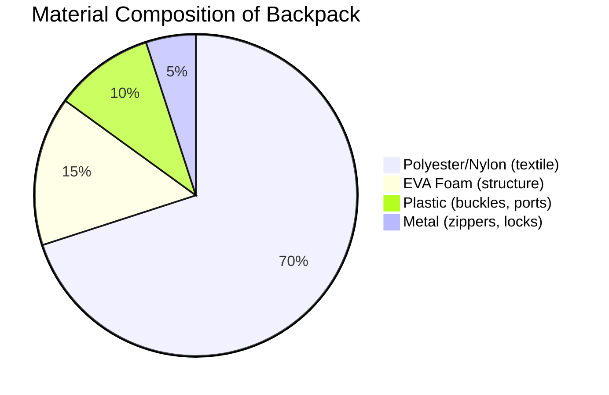

**Final Classification: HS 4202.92 (TARIC 4202 92)**

---

## 5. Binding Ruling & Legal Certainty (ILT6)

### 5.1 Purpose of Binding Rulings

As covered in **ILT6**, a binding tariff ruling is a formal, legally enforceable decision issued by a customs authority that confirms the tariff classification of a specific product. Its primary functions are:

1. **Legal certainty** — The importer knows in advance which duty rate applies.
2. **Risk mitigation** — Eliminates the possibility of reclassification at the border.
3. **Compliance assurance** — Demonstrates good faith and due diligence in classification.

### 5.2 Referenced Ruling: US CBP Ruling N343667

To support the classification of the Modular Anti-Theft Travel Backpack under HS 4202.92, this project references **US Customs and Border Protection Ruling N343667**, which addresses a product of substantially similar characteristics.

| Field | Detail |
|---|---|
| **Issuing Authority** | US Customs & Border Protection |
| **Ruling Number** | N343667 |
| **Product Described** | Textile backpack with anti-theft features |
| **Classification** | HS 4202.92 |
| **US Subheadings Referenced** | 4202.92.3120, 4202.92.1500, 4202.92.4500 |
| **Key Rationale** | Outer surface = textile; essential character = textile container; anti-theft features do not alter classification |

### 5.3 Analytical Significance

While this ruling originates from the US CBP and is not directly binding on EU/French customs, it serves as **persuasive precedent** and reinforces the analytical soundness of the HS 4202.92 classification. The WCO's Harmonized System is international at the 6-digit level, meaning the chapter, heading, and subheading logic is consistent across jurisdictions.

An importer into France could further seek a **Binding Tariff Information (BTI)** from French customs under the EU's Union Customs Code to obtain equivalent legal certainty within the EU framework.

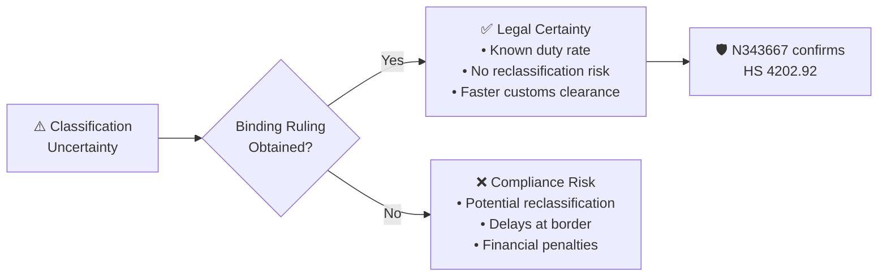

The reference to N343667 demonstrates the importer's commitment to **proactive compliance** — a posture that reduces the likelihood of inspection delays, reclassification disputes, and financial penalties.

---

## 6. Packing & CBM Analysis (ILT07)

### 6.1 Packing Configuration

As addressed in **ILT07**, the physical configuration of goods directly impacts freight costing, container utilisation, and customs valuation. The packing specifications for this product are:

| Parameter | Value |
|---|---|
| Individual packaging | Polybag + single-wall retail carton |
| Packing method | Compressed and flattened for space efficiency |
| Units per master carton | 6 |
| Master carton dimensions (L × W × H) | 0.45 m × 0.49 m × 0.675 m |
| Net weight per unit | 0.9 kg |
| Gross weight per unit | 1.1 kg |
| Gross weight per master carton | ~6.6 kg (6 × 1.1 kg) + carton weight |

### 6.2 CBM Calculation

**Cubic metres (CBM)** per master carton:

> **CBM = 0.45 × 0.49 × 0.675 = 0.1488 m³**  
> **CBM per unit = 0.1488 ÷ 6 = 0.0248 m³**

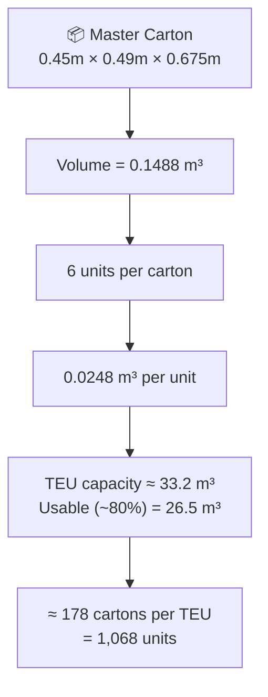

### 6.3 Container Utilisation

A standard 20-foot container (TEU) has an internal volume of approximately **33.2 m³**. Assuming practical loading efficiency of ~80% (accounting for pallet gaps and stacking limits):

| Parameter | Value |
|---|---|
| Usable volume per TEU | ~26.5 m³ |
| Cartons per TEU | 26.5 ÷ 0.1488 ≈ **178 cartons** |
| Units per TEU | 178 × 6 = **1,068 units** |

This calculation demonstrates that a single TEU can accommodate over 1,000 units, confirming that **FCL ocean shipping is scale-appropriate** even for moderate order volumes. The product's **compressed flat-pack packaging** design specifically maximises carton density and container utilisation, reinforcing the transport mode decision made in Section 3.

---

## 7. Customs Valuation Framework (ILT07)

### 7.1 WTO Transaction Value Method

As taught in **ILT07**, the primary method for customs valuation under the WTO Customs Valuation Agreement is the **Transaction Value Method (Article 1)**. This method defines the customs value as the price actually paid or payable for the goods when sold for export to the country of importation, **adjusted** for certain costs.

For CIF (Cost, Insurance, Freight) imports into France, the customs value includes:

1. **FOB price** — the price at the port of export (Shenzhen)
2. **International freight** — cost of ocean transportation to Le Havre
3. **Insurance** — cost of insuring the goods during transit

### 7.2 Customs Value Calculation

| Component | Per Unit (EUR) | % of CIF |
|---|---|---|
| FOB Shenzhen | €18.00 | 86.5% |
| Ocean freight | €2.50 | 12.0% |
| Insurance | €0.30 | 1.5% |
| **CIF Customs Value** | **€20.80** | **100%** |

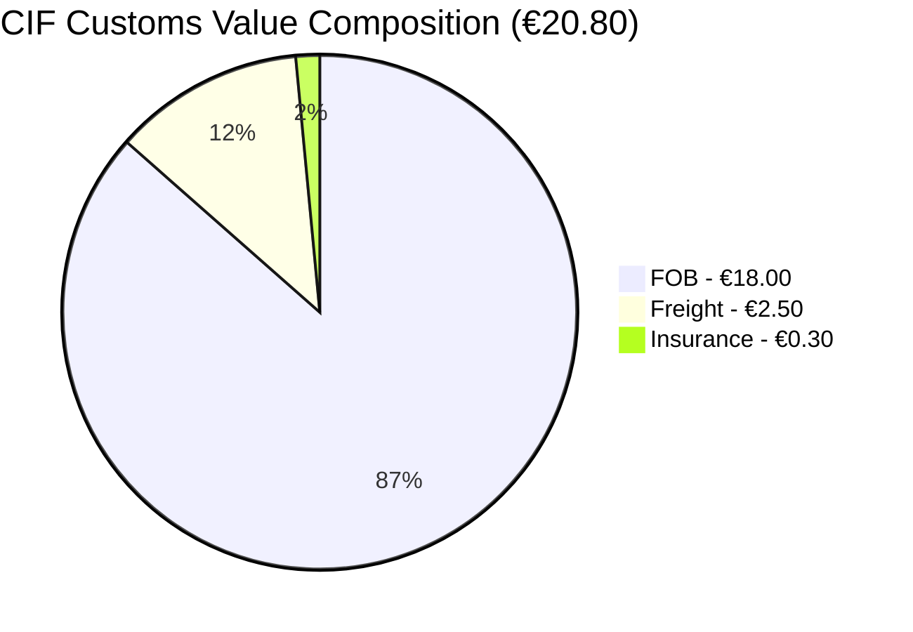

The dominance of the FOB component (86.5% of CIF value) is characteristic of low-weight, non-bulky consumer goods shipped by ocean. This further validates the transport mode selection: freight constitutes only 12% of the customs value, meaning the logistics cost structure is efficient relative to the product value.

---

## 8. Duties & VAT Mechanism (ILT07)

### 8.1 Duty Calculation

The EU Common Customs Tariff applies a duty rate of **17.6%** to goods classified under TARIC 4202 92 (textile-surfaced backpacks) originating from China, absent any preferential trade agreement.

> **Duty = CIF Value × Duty Rate = €20.80 × 17.6% = €3.66**

### 8.2 VAT Calculation

French import VAT is levied at the standard rate of **20%**, applied to the **duty-inclusive value** (CIF + duty):

> **VAT Base = €20.80 + €3.66 = €24.46**  
> **VAT = €24.46 × 20% = €4.89**

### 8.3 Total Import Taxation Summary

| Component | Per Unit (EUR) | Calculation |
|---|---|---|
| CIF Customs Value | €20.80 | FOB + Freight + Insurance |
| Customs Duty (17.6%) | €3.66 | €20.80 × 17.6% |
| VAT Base | €24.46 | €20.80 + €3.66 |
| Import VAT (20%) | €4.89 | €24.46 × 20% |
| **Total Taxes** | **€8.55** | Duty + VAT |
| **Total Landed Cost** | **€29.35** | CIF + Total Taxes |

### 8.4 Cost Build-Up Visualisation

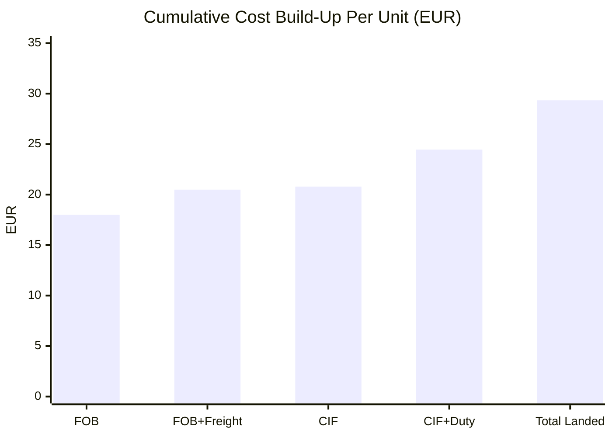

### 8.5 Tax Burden as Percentage of Product Value

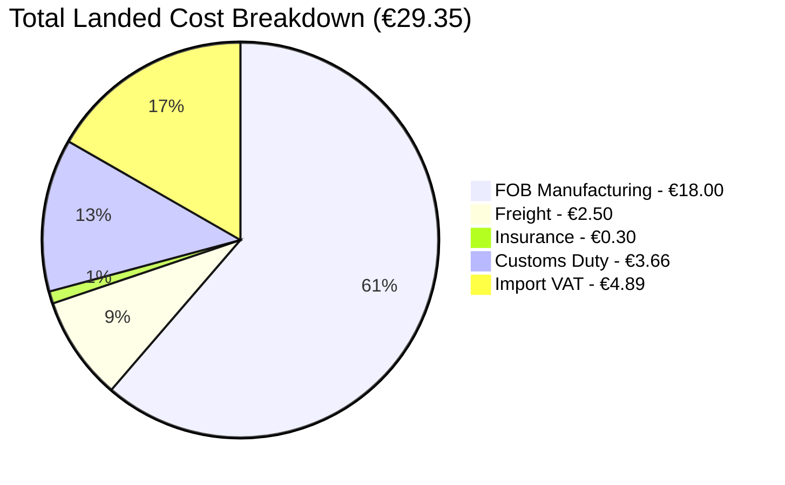

### 8.6 Analytical Observation

The total import taxation (€8.55) represents **41.1% of the CIF value** and **47.5% of the FOB price**. This is a material cost layer that underscores the importance of correct classification: a misclassification into a higher-duty subheading could significantly erode margins. The binding ruling reference (Section 5) is therefore not merely a compliance formality — it is a **financial risk control mechanism**.

Additionally, it is important to note that **VAT is generally recoverable** by registered businesses in France through the standard VAT deduction mechanism, meaning the effective tax burden on a commercial importer is primarily the customs duty (€3.66/unit). However, for customs valuation and compliance purposes, both duty and VAT must be correctly calculated and declared.

---

## 9. Sustainability Integration (ILT5)

### 9.1 Environmental Framework

As introduced in **ILT5**, the environmental impact of international logistics is increasingly central to supply chain decision-making. The course emphasises the **carbon intensity** of different transport modes as a key metric for evaluating sustainability performance.

### 9.2 Carbon Intensity by Mode

| Transport Mode | CO₂ Emissions (g/tonne-km) | Relative Intensity |
|---|---|---|
| Ocean (container vessel) | 10–20 | **Lowest** |
| Rail | 30–50 | Low |
| Road (truck) | 60–150 | Moderate |
| Air | 500–600+ | **Highest** |

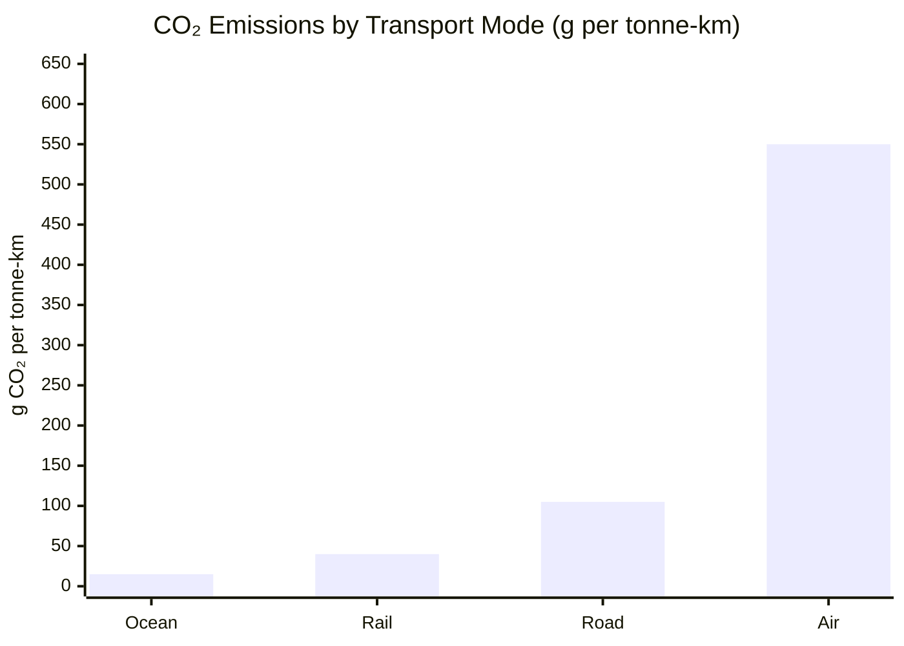

### 9.3 Application to This Project

The selection of ocean freight over air freight is not only an economic decision (Section 3) but also an environmental one. For the shipment parameters of this project:

**Ocean freight carbon footprint estimate (per unit):**
- Gross weight per unit: 1.1 kg = 0.0011 tonnes
- Distance (Shenzhen → Le Havre via Suez): ~16,000 km
- CO₂ = 0.0011 × 16,000 × 15g (midpoint) = **≈ 264 g CO₂**

**Air freight carbon footprint estimate (per unit):**
- Distance (Shenzhen → Paris CDG): ~9,500 km
- CO₂ = 0.0011 × 9,500 × 550g (midpoint) = **≈ 5,748 g CO₂**

| Mode | CO₂ per Unit | Ratio |
|---|---|---|
| Ocean | ≈ 264 g | **1×** |
| Air | ≈ 5,748 g | **≈ 22×** |

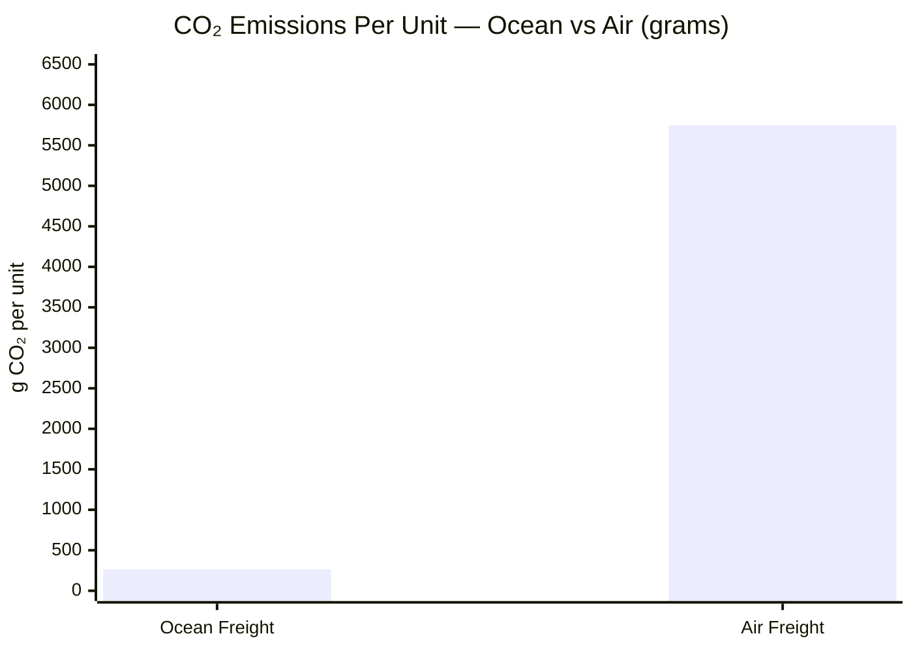

Air freight would generate approximately **22 times more CO₂ per unit** than ocean freight. The selection of ocean transport therefore aligns logistics efficiency with environmental responsibility.

### 9.4 Containerisation Efficiency

Beyond mode selection, the use of **containerised ocean freight (FCL)** contributes to sustainability through:

- **Standardised loading** — minimises wasted space and maximises payload per voyage
- **Economies of scale** — a single container vessel carries 10,000–24,000 TEUs, distributing fixed emissions across a massive cargo volume
- **Reduced handling** — fewer cargo transfers mean lower risk of damage and waste
- **Optimised packaging** — the product's compressed flat-pack design further maximises container utilisation

The ILT5 framework positions sustainability not as an add-on, but as an integrated criterion in logistics design. In this project, the environmental analysis **converges with the economic analysis**: the lowest-cost option is simultaneously the lowest-emission option.

---

## 10. Integrated Compliance Conclusion

This report has constructed a complete, module-by-module international logistics and compliance model for the importation of a Modular Anti-Theft Travel Backpack from China into France. Each decision is grounded in the analytical frameworks introduced across the ILT course.

### Decision Integration Framework

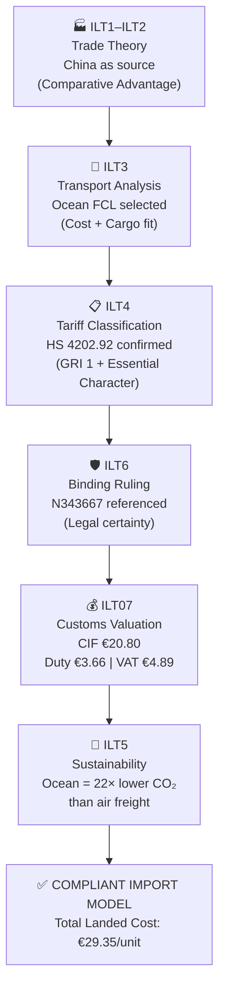

### Summary Table

| Module | Decision/Output | Rationale |
|---|---|---|
| **ILT1–ILT2** | Source from China | Comparative advantage; lowest opportunity cost for textile manufacturing |
| **ILT3** | Ocean freight (FCL) | 208% cost savings over air; non-perishable cargo; no time-sensitivity |
| **ILT4** | HS 4202.92 | GRI 1 applied; textile outer surface (70% polyester/nylon) determines essential character |
| **ILT6** | CBP Ruling N343667 | Confirms classification; reduces reclassification risk; supports proactive compliance |
| **ILT5** | Ocean = sustainable choice | 22× lower CO₂ than air freight per unit |
| **ILT07** | CIF €20.80 → Duty €3.66 → VAT €4.89 | WTO Transaction Value Method; EU tariff rate 17.6%; French VAT 20% |

The model is internally consistent: each module reinforces and validates the decisions made in the others. The sourcing decision drives the transport decision, which feeds the customs valuation, which determines the duty exposure, which is secured by the classification analysis and binding ruling. Sustainability is not a separate workstream — it is embedded in the transport and logistics choices already made.

This report demonstrates that a structured, analytical approach to international logistics — grounded in trade theory, regulatory compliance, and quantitative reasoning — produces an import model that is **economically efficient, legally robust, and environmentally responsible**.

---

## Appendices

### Appendix A – Key Data Summary

| Item | Value |
|---|---|
| Product | Modular Anti-Theft Travel Backpack |
| Benchmark | Pacsafe Vibe 25 |
| Dimensions | 48 × 32 × 18 cm |
| Net Weight | 0.9 kg |
| Gross Weight | 1.1 kg |
| Materials | 70% Polyester/Nylon, 15% EVA, 10% Plastic, 5% Metal |
| HS Code | 4202.92 (TARIC 4202 92) |
| Origin | Shenzhen, China |
| Destination | Le Havre, France |
| FOB Price | €18.00/unit |
| Units per Carton | 6 |
| Carton Dimensions | 0.45 × 0.49 × 0.675 m |
| CBM per Carton | 0.1488 m³ |
| Ocean Freight | €2.50/unit |
| Insurance | €0.30/unit |
| CIF Value | €20.80/unit |
| Duty Rate | 17.6% |
| Duty Amount | €3.66/unit |
| VAT Rate | 20% |
| VAT Amount | €4.89/unit |
| Total Landed Cost | €29.35/unit |

### Appendix B – Binding Ruling Reference

| Field | Detail |
|---|---|
| Ruling Number | N343667 |
| Issuing Authority | US Customs and Border Protection |
| Product | Textile backpack with anti-theft features |
| Classification | HS 4202.92 |
| US Subheadings | 4202.92.3120, 4202.92.1500, 4202.92.4500 |
| Principle Applied | GRI 1; essential character = textile outer surface |

### Appendix C – Glossary

| Term | Definition |
|---|---|
| FOB | Free on Board — seller's responsibility ends when goods are loaded on the vessel at port of export |
| CIF | Cost, Insurance, Freight — customs value basis for EU imports, includes all costs to port of destination |
| CBM | Cubic Metres — volumetric measurement for freight calculation |
| TEU | Twenty-foot Equivalent Unit — standard container measurement (≈ 33.2 m³ internal) |
| HS | Harmonized System — international tariff classification nomenclature administered by WCO |
| GRI | General Rules of Interpretation — rules governing HS classification decisions |
| BTI | Binding Tariff Information — EU equivalent of a binding ruling under the Union Customs Code |
| FCL | Full Container Load — exclusive use of an entire container |
| TARIC | Integrated Tariff of the European Communities — EU-specific tariff database |
| EVA | Ethylene-Vinyl Acetate — foam material used for structural padding |
| RFID | Radio-Frequency Identification — technology blocked by anti-theft pocket lining |

---

*End of Report*